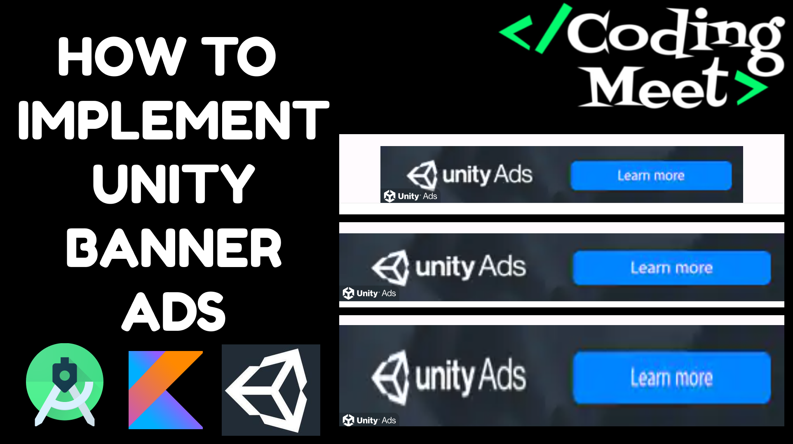

# Unity Ads in Android Studio Kotlin Tutorial Playlist

Welcome to the tutorial playlist on integrating Unity Ads into your Android Studio projects using Kotlin. In this series, you'll learn how to monetize your Android apps effectively with Unity Ads. Whether you're a beginner or an experienced developer, these tutorials will guide you through the process seamlessly.

## Tutorials

1. **[Implementing Unity Banner Ads](https://youtu.be/L0DUTyA774U?si=GOGc4mnKP3_VPoB6)**

   - Learn how to integrate Unity Banner Ads into your Android Studio project using Kotlin for effective and unobtrusive ad placement.

2. **[Integrating Unity Interstitial Ads](https://youtu.be/0SJvsHObe5A?si=s5PdFCrovp5Nb0m4)**

   - Explore the process of implementing Unity Interstitial Ads in your Android Studio project with Kotlin for increased ad revenue.

3. **[Adding Unity Rewarded Video Ads](https://youtu.be/buTctAnAVZ4?si=lSF482jhjopLyiDG)**

   - Follow along to implement Unity Rewarded Video Ads in your Android Studio project using Kotlin for rewarding user engagement.

Feel free to go through the tutorials in the order that suits your needs or jump to specific topics based on your requirements. Each tutorial provides clear instructions, code snippets, and tips to make the implementation process smooth and efficient.

## Support the Project

If you find this tutorial series helpful and would like to support the development of more content, consider buying me a coffee! Your support helps in creating high-quality tutorials.

Your generosity is greatly appreciated! Thank you for supporting this project.

Happy coding!
